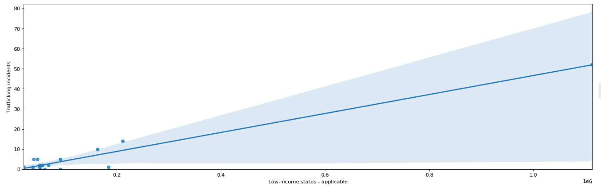
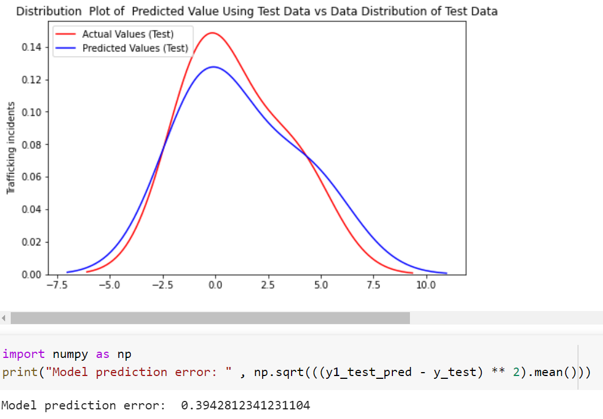

# DataJam Canada 2021 - _**TRACKS: A Trafficking Reporting and Compilation frameworK System:**_

## 1. Problem Statement

Transport of victims is a major component of human trafficking. According to [Human-Trafficking Corridors in Canada by The Canadian Centre to End Human Trafficking](https://www.canadiancentretoendhumantrafficking.ca/wp-content/uploads/2021/02/Human-Trafficking-Corridors-in-Canada-Report.pdf), moving victims routinely aids traffickers from being detected by law enforcement and disorients victims and impedes them from seeking help. There is a lack of user-friendly reporting systems in place for those working in the transportation industry who are likely to see trafficking activity and a lack of methods to identify common trafficking routes. For example Uber has an emergency alert system for passengers but not for drivers; drivers must rely on hotlines to report incidents. This is not ideal and verbal information is easily lost.

## 2. Objective

Domestic trafficking via ground transport is a serious problem in Canada. Our objective is therefore to propose a framework to facilitate reporting of trafficking suspicions by drivers. Collections of reports can then be used to gain insights on high-risk areas and routes for trafficking, aiding law enforcement to catch perpetrators. 

## 3. Solution/Data use case description

TRACKS: Trafficking Reporting, Analysis, Compilation frameworK System

TRACKS has three components:
1. Using factors which indicate vulnerability to trafficking (poverty, indigenous population, unemployment and education level) together with existing trafficking data as ground truth, we identify regions with higher risk of trafficking activity.
2. We use the geolocation data of the driver to identify their trip's region(s). If they are detected to be in a high risk region, a notification is sent to them to report trafficking suspicions via a short form based on [UNODC indicators of trafficking](https://www.unodc.org/pdf/HT_indicators_E_LOWRES.pdf). 
3. Data from the form such as location and date/timestamps is anonymized, collected and analyzed in order to refine our prediction algorithm. Our aim is to collaborate with law enforcement so this data can be used to identify trafficking cases. There is limited data which can be used to identify trafficking routes, and this framework provides a means to collect data useful for this purpose.

The framework is versatile and can be applied to different provinces or for interprovincial anti-trafficking initiatives by using different datasets to train the model. Ride-sharing services such as Uber are popular in other countries in addition to Canada, and our the framework can be applied internationally to promote reporting of trafficking suspicions among transportation companies. By modifying aspects such as factors indicating vulnerability to trafficking and training data, the framework can better reflect the needs of other countries. 

Our solution can be a stand-alone app or it can be integrated into existing apps. An advantage of having a stand-alone app is that we do not need to ask a private company for access to location data.

In this proof of concept, we used data for regions in Ontario for which data on incidents of trafficking is available, and focused only on these select regions. Data on the factors (poverty, indigenous population, unemployment and education level) and trafficking is available for other Canadian regions. A direction for future work is to train our model with a larger dataset including these regions. The trained model can then be applied to other regions for which trafficking data is not available. For a simple use case, we use GO transit coordinates as driver location input to our framework as these are potential origin or destination points, especially for victims travelling by public transport. In addition, origin-destination data for Uber trips is publicly available for Toronto (and other international cities), and by processing this data we can extend our use case testing.

## 4. Pitch

Our pitch can be found here:
 [link to video](https://youtu.be/uyt09UPmrag)

## 5. Datasets

Location: [/datasets](datasets)

2016 Canada Census data is used here. Data was downloaded from the official site and relevant variables were extracted for regions of interest. Data was cleaned and formatted before using for modeling. The hierarchy of regions (e.g. Census subdivision, Census metropolitan areas) for which data is available varies among the datasets and therefore it was a challenge to find datasets with a matching system of regions for comparison. In certain cases, information for some regions was missing.

**Sources**:

Human Trafficking Incidents and Sexual Exploitation Incidents: 
[Statistics Canada. Table 35-10-0177-01  Incident-based crime statistics, by detailed violations, Canada, provinces, territories and Census Metropolitan Areas](https://www150.statcan.gc.ca/t1/tbl1/en/tv.action?pid=3510017701)

For this proof of concept, we looked at regions in Ontario for which human trafficking data is available.

Income: 
[Statistics Canada, 2016 Census of Population, Statistics Canada Catalogue no. 98-400-X2016133.](https://www12.statcan.gc.ca/census-recensement/2016/dp-pd/dt-td/Rp-eng.cfm?LANG=E&APATH=3&DETAIL=0&DIM=0&FL=A&FREE=0&GC=0&GID=0&GK=0&GRP=1&PID=111873&PRID=10&PTYPE=109445&S=0&SHOWALL=0&SUB=0&Temporal=2016&THEME=119&VID=0&VNAMEE=&VNAMEF=)

Aboriginal Population: [Statistics Canada, 2016 Census of Population, Statistics Canada Catalogue no. 98-400-X2016173.]( https://www12.statcan.gc.ca/census-recensement/2016/dp-pd/dt-td/Rp-eng.cfm?TABID=2&LANG=E&APATH=3&DETAIL=0&DIM=0&FL=A&FREE=0&GC=0&GID=1341753&GK=0&GRP=1&PID=111095&PRID=10&PTYPE=109445&S=0&SHOWALL=0&SUB=0&Temporal=2017&THEME=122&VID=0&VNAMEE=&VNAMEF=&D1=0&D2=0&D3=0&D4=0&D5=0&D6=0)

Employment & Education: [Statistics Canada, 2016 Census of Population, Statistics Canada Catalogue no. 98-400-X2016284.](https://www12.statcan.gc.ca/census-recensement/2016/dp-pd/dt-td/Rp-eng.cfm?TABID=2&LANG=E&APATH=3&DETAIL=0&DIM=0&FL=A&FREE=0&GC=3515&GID=1259598&GK=2&GRP=1&PID=111848&PRID=10&PTYPE=109445&S=0&SHOWALL=0&SUB=0&Temporal=2017&THEME=124&VID=0&VNAMEE=&VNAMEF=&D1=0&D2=0&D3=0&D4=0&D5=0&D6=0)

Latitude-Longitude Coordinates for Ontario Regions: https://developer.mapquest.com/documentation/tools/latitude-longitude-finder/

Latitude-Longitude Coordinates for GO Transit Stops used in Use Case: http://www.metrolinx.com/en/aboutus/opendata/default.aspx

Additional data found for future use:

Origin-Destination of Drivers - Record of Uber Trips: https://movement.uber.com/?lang=en-CA

Detailed Record of Uber Trips: https://www.kaggle.com/fivethirtyeight/uber-pickups-in-new-york-city

## 6. Project Code

Location: [/project](project)

- User Interface code

the UI code is in the [ReportingGUI](https://github.com/TAHDataJamCanada2021/Data-Lionesses/tree/main/project/ReportingGUI) folder and includes forms generated based on our model's result for the drivers to fill in and eventually for the report to be sent to relevant authorities. The UI is built in Python 3.9 and uses the Kivy framework.

- Model code

The model code is implemented on a Python Notebook which can be found at [Model](https://github.com/TAHDataJamCanada2021/Data-Lionesses/tree/main/project/Model/Data_Lionesses_Model.ipynb). The notebook includes data analysis, exploration and model builing for the project. The data used for the model is preprocessed and cleaned according to the project requirements. The steps taken for data preprocessing are elaborated in [Data Preprocessing](https://github.com/TAHDataJamCanada2021/Data-Lionesses/tree/main/datasets/Preprocessed%20Data/README.md).

The working of the notebook is summarized as follows: 

The data used in the notebook is imported from the "Preprocessed data" folder. Each dataset, namely the income data, education & employment data, aboriginal data, sexploitation data, and trafficking data, is converted to a pandas dataframe for data analysis / data exploration. Out of these datasets, we take income data, education & employment data, aboriginal data as features, and sexploitation data, trafficking data as labels for supervised learning.

The datatypes of each datast is verified and all features from each dataset is correlated with the labels. The features that have the maximum correlation value, or the highest dependency on the label, are taken as input features for the model. We find that the features having the highest correlation for the income data, education & employment data, aboriginal data are 'Low-income status - applicable', 'Unemployed', and 'Aboriginal Low-income status - applicable' respectively for each dataset. Further, we also find that these features are linearly dependent on the labels (trafficking / sexploitaiton incidents). The linearity is shown by plotting each feature against the labels on a graph.
 
 

 
 
Thus, we choose a linear model for predicting the trafficking incidents for a region, given its income status, unemployment, and aboriginal income status data. We train the supervised model on 85% of the data and test the model on 15% of the given data. The result produced by the model has a root mean square error of 0.394 which is obtained by comparing the trafficking incidents predicted by the model with the actual trafficking incidents in the region. In the interest of time, a small dataset (about 16 rows) was taken for the prototype and hence the model can further be improved by increasing the size of the dataset. 

The Linear model was also compared to a Neural Network, which produced a root mean square error of 0.40. Since the size of the data is smaller and the features have a linear dependency on the labels, we choose a Linear Regression model for the purpose of the project. The results obtained by the Linear Regression model, along with its error rate are given below. 
 
 

 
 
Additionally, the code to fetch the driver's region based on their latitude / longitude coordinates has also been included in the notebook. This code block can be used in real time to fetch the driver's region and send the form (developed in the User Interface code) to notify that the driver is entering into a high risk region and request for their feedback on if they were suspicious about the passengers.

- Overall working

The trained machine learning model will be integrated with the User Interface and a database to fetch the predicted trafficking values of a region, and based on a given threshold, it will notify the driver if they enter a high risk region.

- Future work

Due to the time limitation, the model is focused on about 16 regions in Ontario for which data on human trafficking was readily available. However, the model can be extended to other regions in Ontario or beyond in the followng two ways:

1. Obtain the income, unemployed, aboriginal income for other regions in Ontario and predict the trafficking cases for each region based on the features. These additional regions would be added to the database to get accurate decisions on whether the region is high risk based on a driver's location.

2. Implement a clustering algorithm to match a new region to the closest existing region in terms of its features and output a predicted value for the trafficking cases in that region. The functionality of this feature is similar to the first one where additional regions can be added to the database which would provide accurate predictions on the high risk areas.

Additionally, the current model focuses on the trafficking incidents as a whole, and can be extended to particular domains such as sexploitaition, forced labour, child exploitation, etc. This could help in identifying more areas as high risk for each of the given domains, and the feedback form can be sent to the driver accordingly.

## 7. Additional Docs

Location: [/docs](docs)

- PowerPoint presentation
- *TRACKS Use Case Diagram.png* describes how users interact with various components of the system.
- *report.xml* is a sample report generated by the front end.
- Maps & Charts folder contains data visualizations of factors indicating vulnerabilty to trafficking, and recorded trafficking incidents in regions of Ontario.
- Additional videos/demo
- Protocols
- Guides
