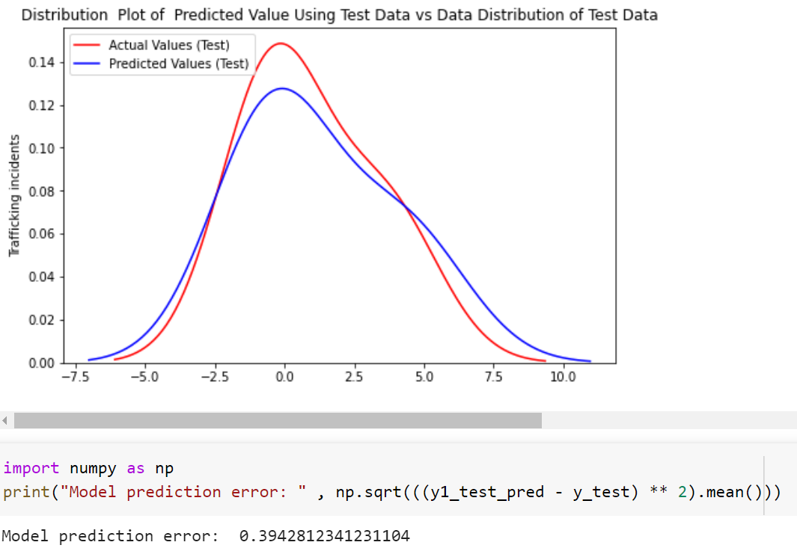

# Project Code
- **Model** contains a Python notebook that includes data analysis and the machine learning model for the project.
- **ReportingGUI** contains user interface code - see supplementary documentation for more details.

**User Interface Code**

The UI code, implemented in the Python 3.9 programming language, in conjunction with the Kivy framework, is in the [ReportingGUI](https://github.com/TAHDataJamCanada2021/Data-Lionesses/tree/main/project/ReportingGUI) folder and includes forms generated based on our model's result for the drivers to fill in and eventually for the report to be sent to investigators. The UI is activated when the backend flags a suspicious trip. The UI asks whether one or more of their riders appear to potentially be a victim of human trafficking. 3-4 screens follow, prompting the driver to answer whether or not key indicators (as set out by the UNODC) were present during the trip. A final set of forms guides the user to answer questions about the persons involved, including description and names used. Submitting these answers generates a report, which, combined with location and time/date data from their phones, are compiled and sent to authorities and investigators.

**Model Code**

The model code is implemented on a Python Notebook which can be found at [Model](https://github.com/TAHDataJamCanada2021/Data-Lionesses/tree/main/project/Model/Data_Lionesses_Model.ipynb). The notebook includes data analysis, exploration and model builing for the project. The data used for the model is preprocessed and cleaned according to the project requirements. The steps taken for data preprocessing are elaborated in [Data Preprocessing](https://github.com/TAHDataJamCanada2021/Data-Lionesses/tree/main/datasets/Preprocessed%20Data/README.md).

The working of the notebook is summarized as follows: 

The data used in the notebook is imported from the "Preprocessed data" folder. Each dataset, namely the income data, education & employment data, aboriginal data, sexploitation data, and trafficking data, is converted to a pandas dataframe for data analysis / data exploration. Out of these datasets, we take income data, education & employment data, aboriginal data as features, and sexploitation data, trafficking data as labels for supervised learning.

The datatypes of each datast is verified and all features from each dataset is correlated with the labels. The features that have the maximum correlation value, or the highest dependency on the label, are taken as input features for the model. We find that the features having the highest correlation for the income data, education & employment data, aboriginal data are 'Low-income status - applicable', 'Unemployed', and 'Aboriginal Low-income status - applicable' respectively for each dataset. Further, we also find that these features are linearly dependent on the labels (trafficking / sexploitaiton incidents). The linearity is shown by plotting each feature against the labels on a graph.
 
 

 
 
Thus, we choose a linear model for predicting the trafficking incidents for a region, given its income status, unemployment, and aboriginal income status data. We train the supervised model on 85% of the data and test the model on 15% of the given data. The result produced by the model has a root mean square error of 0.394 which is obtained by comparing the trafficking incidents predicted by the model with the actual trafficking incidents in the region. In the interest of time, a small dataset (about 16 rows) was taken for the prototype and hence the model can further be improved by increasing the size of the dataset. 

The Linear model was also compared to a Neural Network, which produced a root mean square error of 0.40. Since the size of the data is smaller and the features have a linear dependency on the labels, we choose a Linear Regression model for the purpose of the project. The results obtained by the Linear Regression model, along with its error rate are given below. 
 
 

 
 
Additionally, the code to fetch the driver's region based on their latitude / longitude coordinates has also been included in the notebook. This code block can be used in real time to fetch the driver's region and send the form (developed in the User Interface code) to notify that the driver is entering into a high risk region and request for their feedback on if they were suspicious about the passengers.

- Overall working

The trained machine learning model will be integrated with the User Interface and a database to fetch the predicted trafficking values of a region, and based on a given threshold, it will notify the driver if they enter a high risk region.

- Future work

Due to the time limitation, the model is focused on about 16 regions in Ontario for which data on human trafficking was readily available. However, the model can be extended to other regions in Ontario or beyond in the followng two ways:

1. Obtain the income, unemployed, aboriginal income for other regions in Ontario and predict the trafficking cases for each region based on the features. These additional regions would be added to the database to get accurate decisions on whether the region is high risk based on a driver's location.

2. Implement a clustering algorithm to match a new region to the closest existing region in terms of its features and output a predicted value for the trafficking cases in that region. The functionality of this feature is similar to the first one where additional regions can be added to the database which would provide accurate predictions on the high risk areas.

Additionally, the current model focuses on the trafficking incidents as a whole, and can be extended to particular domains such as sexploitaition, forced labour, child exploitation, etc. This could help in identifying more areas as high risk for each of the given domains, and the feedback form can be sent to the driver accordingly.
